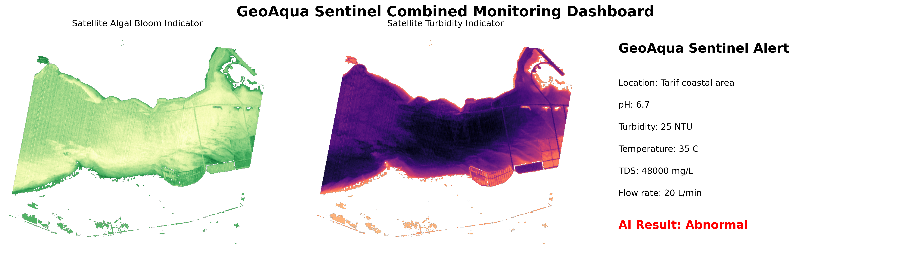
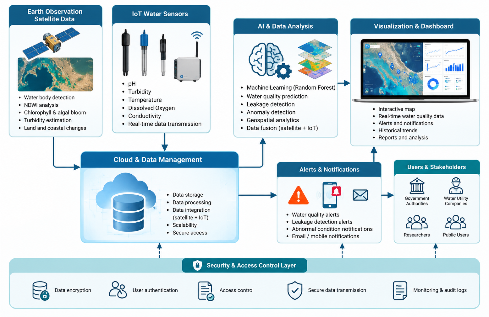

# GeoAqua Sentinel

AI-Powered IoT Platform for Smart Water Quality and Leakage Monitoring Using Earth Observation and Geospatial Analytics

## 1. Project Overview

GeoAqua Sentinel is a proof of concept for water monitoring in the UAE and wider Arab region.

The project combines Planet Tanager hyperspectral satellite imagery, simulated IoT measurements, and a Random Forest model to examine water conditions and generate inspection alerts.

- Country: United Arab Emirates
- Event: Arab Youth Space Hackathon 2026, 813 Challenge
- Focus: Water quality, inland and coastal water intelligence
- Study area: Tarif coastal area, Al Dhafra, Abu Dhabi
- Status: Proof of concept using satellite imagery and synthetic sensor data

The current demonstration focuses on water quality indicators and abnormal sensor readings. Leakage detection is a future development goal. The current model does not confirm a physical leak.

## 2. Business Use Case

The intended users are water monitoring teams, environmental authorities, and coastal facility operators.

These users need to decide where further inspection or water sampling is required.

GeoAqua Sentinel brings satellite indicators and local measurement analysis into one workflow. The demonstration produces an inspection alert when the example sensor reading is abnormal or a satellite indicator exceeds a demonstration threshold.

The proposed operational use is to support inspection decisions alongside field measurements and laboratory testing.

## 3. Problem and Proposed Solution

Manual inspections provide measurements at specific locations and times. Isolated sensors provide local readings but offer limited information about surrounding coastal conditions.

Satellite imagery adds spatial information about open water, chlorophyll indicators, and suspended sediment indicators.

GeoAqua Sentinel combines:

- Earth Observation imagery
- Simulated IoT water measurements
- Machine learning classification
- Satellite and IoT alert logic
- Interactive sensor input controls
- Dashboard visualization

Satellite indices serve as environmental indicators. They do not directly measure pH, TDS, water flow, or underground pipe leakage in this demonstration.

## 4. Repository Files

| File | Purpose |
| --- | --- |
| `README.md` | Project documentation and execution instructions |
| `GeoAqua_Sentinel_PoC.ipynb` | Main satellite analysis and AI demonstration notebook |
| `requirements.txt` | Listed Python dependencies |
| `GeoAqua_Synthetic_IoT_Data.csv` | Example dataset with 500 synthetic sensor records |
| `GeoAqua_Sentinel_Dashboard.png` | Example combined monitoring dashboard |
| `confusion matrix.png` | Example AI classification result |
| `System_Architecture.png` | Proposed system architecture |

## 5. Data Used

### Satellite Data

- Provider: Planet Labs PBC
- Instrument: Tanager hyperspectral
- Collection: `coastal-water-bodies`
- Selected scene: `20250511_074311_00_4001`
- Selected scene date: 11 May 2025
- Product used: Surface reflectance in HDF5 format
- Asset selection: `ortho_sr_hdf5`, with `basic_sr_hdf5` as the notebook fallback
- Quality filtering: Cloud, cirrus, and nodata masks
- Licence stated in the source notebook: CC BY 4.0, © Planet Labs PBC

The notebook retrieves metadata for three scenes and analyzes the first scene:

1. `20250511_074311_00_4001`
2. `20250223_165546_32_4001`
3. `20250406_170447_47_4001`

Collection URL:

https://www.planet.com/data/stac/tanager-core-imagery/coastal-water-bodies/collection.json

Satellite files are downloaded during execution. They are not included in this repository.

### Synthetic IoT Data

The notebook generates 500 simulated records:

- 250 Normal records
- 250 Abnormal records
- Random seed: 42

The measurements represent a coastal water demonstration and are not real sensor observations.

| Column | Description | Unit |
| --- | --- | --- |
| `pH` | Acidity or alkalinity | pH |
| `Turbidity_NTU` | Water turbidity | NTU |
| `Temperature_C` | Water temperature | °C |
| `TDS_mg_L` | Total dissolved solids | mg/L |
| `Water_Flow_L_min` | Water flow rate | L/min |
| `Result` | Synthetic class label | Normal or Abnormal |

Example data file:

[GeoAqua_Synthetic_IoT_Data.csv](GeoAqua_Synthetic_IoT_Data.csv)

The notebook regenerates the synthetic dataset during execution and exports the CSV at the end.

## 6. Technical Approach

The notebook follows this sequence:

1. Retrieve Planet Tanager scene metadata.
2. Select the first scene.
3. Display the scene metadata and map.
4. Download the surface reflectance HDF5 file.
5. Exclude cloud, cirrus, and nodata pixels.
6. Select spectral bands nearest the required wavelengths.
7. Calculate satellite indices.
8. Display index maps and spectral plots.
9. Generate 500 synthetic IoT records.
10. Divide the records into training and test sets.
11. Train a Random Forest classifier.
12. Evaluate predictions on the test set.
13. Classify an example sensor reading.
14. Display interactive sensor input controls.
15. Combine satellite indicators with the example IoT classification.
16. Generate the final dashboard and export example files.

### Satellite Indices

| Indicator | Formula | Demonstration purpose |
| --- | --- | --- |
| NDWI | `(R560 - R860) / (R560 + R860)` | Identify water pixels |
| NDCI | `(R708 - R665) / (R708 + R665)` | Chlorophyll and algal bloom proxy |
| Turbidity proxy | `(R665 - R560) / (R665 + R560)` | Suspended sediment indicator |
| NDVI | `(R800 - R665) / (R800 + R665)` | Supporting vegetation analysis |

The implementation adds a small value to each denominator to reduce division errors.

### AI Model

- Model: Random Forest classifier
- Inputs: pH, turbidity, temperature, TDS, and flow
- Target: Normal or Abnormal
- Training split: 80%, 400 records
- Test split: 20%, 100 records
- Stratified split: Yes
- Number of trees: 100
- Maximum tree depth: 5
- Random state: 42

### Combined Alert Logic

The notebook identifies water pixels using:

`NDWI > 0.1`

Within these pixels, the notebook calculates the 95th percentile of NDCI and the turbidity proxy.

An inspection alert appears when any of these conditions applies:

- The example IoT reading is classified as Abnormal.
- The satellite NDCI statistic exceeds 0.2.
- The satellite turbidity statistic exceeds 0.1.

These thresholds support the demonstration. They have not been calibrated against field measurements.

## 7. Installation

### Option A: Google Colab

1. Open https://colab.research.google.com
2. Choose **File → Open notebook → GitHub**.
3. Paste this repository URL:

   https://github.com/noufmansoor/GeoAqua-Sentinel

4. Open `GeoAqua_Sentinel_PoC.ipynb`.
5. Run the first installation cell.
6. Before running the AI section, run this command in an additional code cell:

   ```python
   %pip install pandas scikit-learn
   ```

7. Restart the runtime if package installation requests a restart.
8. Run the notebook from the beginning.

### Option B: Local Jupyter

Use Python 3.12 as the setup target.

The notebook metadata records Python 3.9.6 from an earlier environment. The complete dependency list has not yet been verified in a clean Python 3.12 environment.

Clone the repository:

```bash
git clone https://github.com/noufmansoor/GeoAqua-Sentinel.git
cd GeoAqua-Sentinel
```

Create a virtual environment:

```bash
python3.12 -m venv .venv
```

Activate the environment on macOS or Linux:

```bash
source .venv/bin/activate
```

Activate the environment on Windows PowerShell:

```powershell
.\.venv\Scripts\Activate.ps1
```

Install the dependencies:

```bash
python -m pip install --upgrade pip
python -m pip install -r requirements.txt
python -m pip install jupyterlab
```

Start JupyterLab:

```bash
python -m jupyterlab
```

Open `GeoAqua_Sentinel_PoC.ipynb`.

The notebook contains an additional installation cell with unpinned packages. For a local run using `requirements.txt`, skip this cell to preserve the installed package versions.

## 8. How to Run

### Full Demonstration

1. Open `GeoAqua_Sentinel_PoC.ipynb`.
2. Complete installation using one of the options above.
3. Run all remaining cells in order.
4. Wait for the satellite download to finish.
5. Continue through the satellite analysis, AI training, and dashboard cells.
6. Check the final printed alert and exported files.

No API key is requested by the current notebook.

The example uses the first scene in `item_ids`. No scene changes are required to reproduce the saved demonstration.

An internet connection is required for package installation, satellite metadata, satellite downloads, and map services.

Full runtime has not yet been measured. The satellite download depends on connection speed and external service availability.

### AI Section Only

To inspect the synthetic IoT classification independently, run these cells in order:

1. The cell generating 250 Normal and 250 Abnormal records, beginning with `np.random.seed(42)`.
2. The Random Forest training and evaluation cell.
3. The example prediction cell beginning with `new_reading = pd.DataFrame(...)`.
4. The interactive dashboard cell, if desired.

This reproduces the synthetic classification result. The combined satellite dashboard requires the earlier satellite analysis cells.

## 9. Example Input and Output

### Example Sensor Input

| Parameter | Value |
| --- | --- |
| pH | 6.7 |
| Turbidity | 25 NTU |
| Temperature | 35 °C |
| TDS | 48,000 mg/L |
| Flow | 20 L/min |

### Expected AI Output

```text
Accuracy: 1.0
AI Result: Abnormal
ALERT: Dangerous water condition detected!
```

The alert wording comes from the demonstration code. The synthetic model does not establish a health or regulatory assessment.

### Saved Combined Output

The saved notebook reports approximately:

```text
Location: Tarif coastal area
Satellite NDCI: 0.009
Satellite Turbidity: -0.169
IoT and AI Result: Abnormal
FINAL ALERT: Water inspection is required.
```

For this example, the satellite statistics are below the demonstration alert thresholds. The abnormal IoT classification triggers the inspection alert.

### Example Dashboard



### Example Confusion Matrix


### Exported Files

The final notebook cell saves:

- `GeoAqua_Synthetic_IoT_Data.csv`
- `GeoAqua_Sentinel_Dashboard.png`

The confusion matrix appears during evaluation. The current notebook does not explicitly export the confusion matrix image.

## 10. Results and Validation

The saved notebook reports these results on 100 synthetic test records:

| Metric | Result |
| --- | --- |
| Accuracy | 100% |
| Precision, Normal | 100% |
| Precision, Abnormal | 100% |
| Recall, Normal | 100% |
| Recall, Abnormal | 100% |
| F1-score, Normal | 100% |
| F1-score, Abnormal | 100% |
| Normal test records | 50 |
| Abnormal test records | 50 |

The dataset generation and AI classification sections were reproduced during repository review. The generated records matched the uploaded CSV.

The review used an existing environment rather than a fresh installation from `requirements.txt`. A clean local installation still requires verification.

### Interpretation

The synthetic groups use separate ranges for turbidity, TDS, and flow. This makes classification easier and explains the perfect test score.

The result demonstrates a functioning synthetic classification workflow. The score does not establish performance on real sensor data.

Satellite indicators have not been validated against matching field samples or confirmed pollution events.

## 11. Limitations

- All IoT measurements are synthetic.
- No physical IoT station has been tested.
- The demonstration analyzes one selected satellite scene.
- Satellite and simulated sensor data do not represent matched field observations.
- Satellite indices are proxies rather than calibrated water quality measurements.
- Alert thresholds have not been validated with field data.
- The model does not confirm leakage or predict a leak before occurrence.
- External downloads and map services affect reproducibility.
- Full execution time has not been measured.
- The complete dependency list still requires a clean-environment test.

## 12. Future Development

- Build a physical IoT monitoring station.
- Collect real water measurements.
- Match sensor observations with satellite acquisition times and locations.
- Validate satellite indicators against field samples.
- Test the AI model on independent real measurements.
- Measure false alerts and missed abnormal events.
- Develop and validate dedicated leakage detection logic.
- Improve the geospatial dashboard.
- Evaluate repeated satellite observations.

## 13. System Architecture

The proposed architecture connects satellite observations and IoT measurements to analysis, alert generation, and a monitoring dashboard.

The current prototype implements satellite analysis and simulated IoT classification within a Jupyter notebook.



## 14. Team and Contributions

Country representation: United Arab Emirates

### Suggested Contribution Assignments

These assignments require confirmation from each member before being recorded as completed contributions.

### Alreem Ahmed Alkatheeri

Project research, problem definition, and water monitoring use case.

### Nouf Mansoor Alblooshi

Satellite data analysis, notebook testing, and GitHub repository organization.

### Mouza Abdullah Almansoori

Synthetic IoT dataset preparation, Random Forest classification, and results analysis.

### Marya Mohammed Alhammadi

Dashboard visualization, system architecture diagram, and presentation preparation.

## 15. Licence and Attribution

### Satellite Data

The source notebook states:

CC BY 4.0, © Planet Labs PBC.

Retain the provider attribution when sharing figures derived from the imagery and follow the applicable dataset terms.

### Source Notebook

The satellite exploration workflow adapts educational material credited in the notebook to Dr. Vincent Markiet, Space42.

The GeoAqua Sentinel demonstration adds synthetic IoT records, Random Forest classification, sensor input controls, combined alert logic, and a monitoring dashboard.

### Project Code and Synthetic Data

No separate project licence file is currently included in this repository. The satellite data licence does not automatically cover the project code or synthetic dataset.

